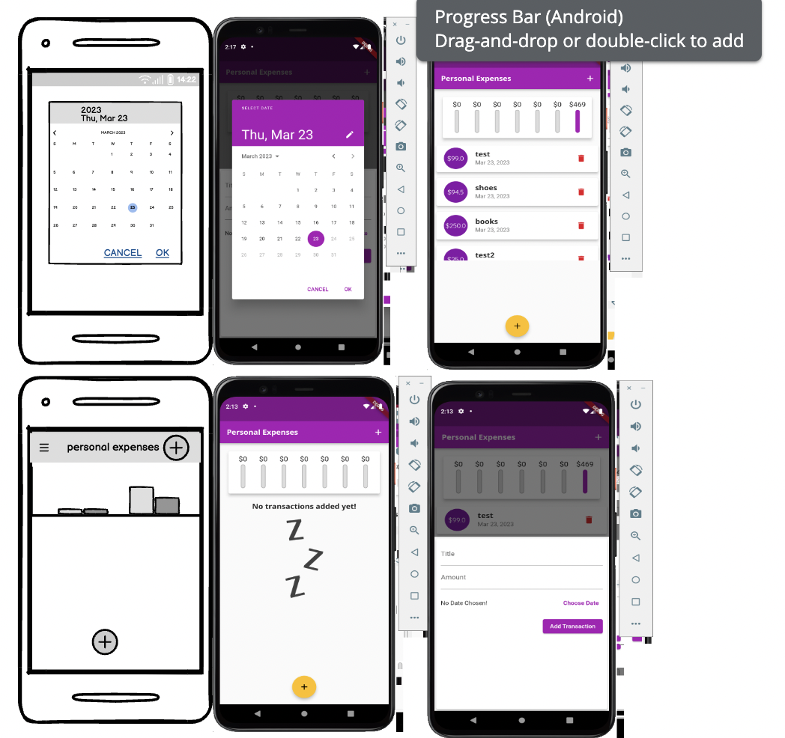
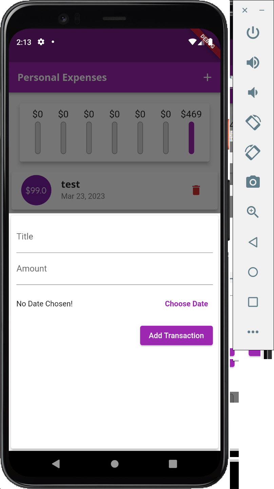
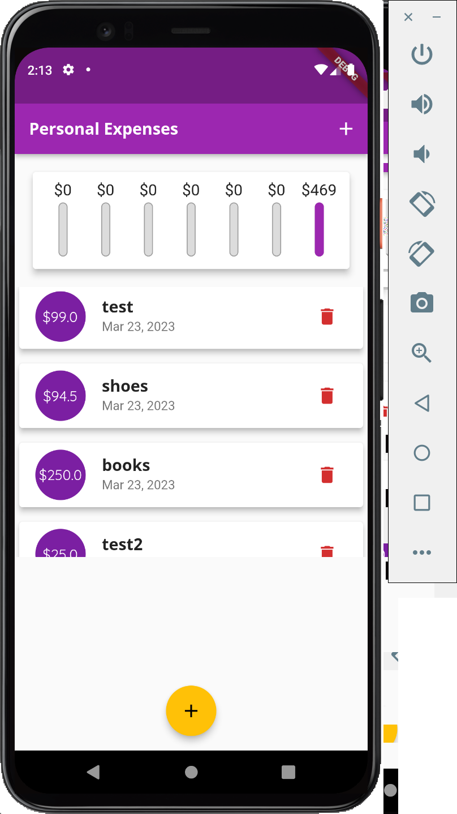

<h1 align="center">expense app</h1>

simple expense tracker app . 

## Dßesign

### App Preview :

<table width="100%"> 
<tr>
<td width="50%">      
&nbsp; 
 

  HOME

</td> 
<td width="50%">
 

  ADMIN

  
</td>
</table>
## Note
* This app is part of flutter course by maximilian schwarzmüller